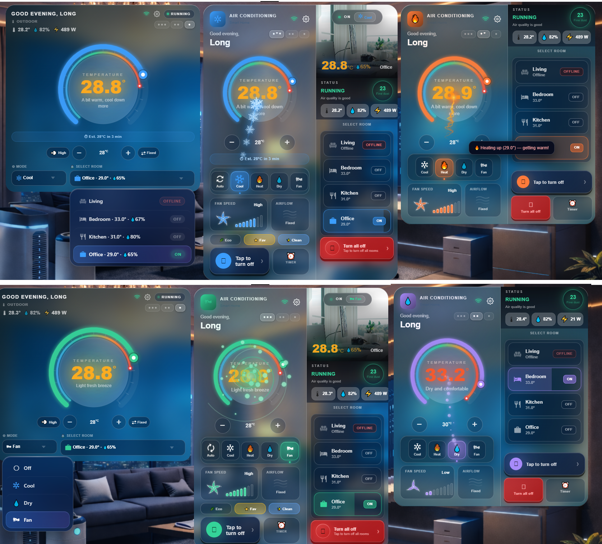

# ❄️ Multi Air Conditioner Card

> Card tùy chỉnh điều khiển điều hòa nhiều phòng cho Home Assistant Lovelace.
> Custom multi-room air conditioner card for Home Assistant Lovelace.

---

### ✨ Tính năng / Features

- ❄️ Đồng hồ nhiệt độ động / Animated temperature dial
- 🏠 Ảnh phòng với badge trạng thái / Room photo with live status badge
- 🔢 Hỗ trợ 1–8 phòng / Supports 1–8 rooms
- 🌿 Chế độ Eco & chip tác vụ nhanh / Eco mode & quick-action chips
- ⏱️ Hẹn giờ từng phòng / Per-room timer scheduling
- 📡 Cảm biến PM2.5, nhiệt độ, độ ẩm, điện năng / Environment sensors
- 🌐 10 ngôn ngữ / 10 languages
- 🎨 16 preset gradient nền / 16 background gradient presets
- 🎛️ Trình chỉnh sửa trực quan đầy đủ / Full visual config editor

---

### 📦 Cài đặt / Installation

Xem hướng dẫn đầy đủ tại / See full instructions at:
👉 [README.md](README.md) (English) · [README_vi.md](README_vi.md) (Tiếng Việt)

---

Designed by **[@doanlong1412](https://github.com/doanlong1412)** 🇻🇳
